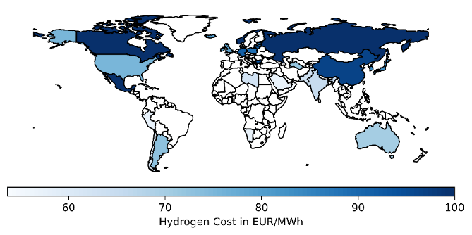
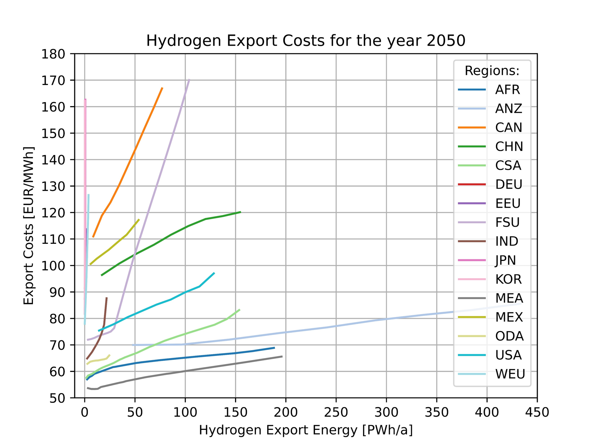
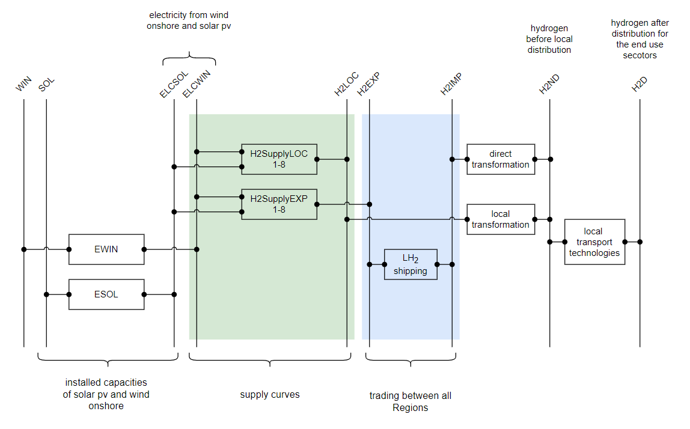

# Regional Hydrogen Cost Potential Curves 

## General information
The cost potential curves are derived by using the models GLAES and RESKit. A detailed description can be found in [1]. The minimal costs for hydrogen production, based on level 1, can be seen in figure 1. All belonging values can be found in figure 2. 

 
Figure 1: Global Hydrogen Cost for all TIAM regions. Source [1]

 
Figure 2: Cost potential curves for all TIAM regions. Source [1]

## Implementation in TIAM

  
Figure 3: Implementation Scheme of Hydrogen Cost-Potential Curves in TIAM.

Hydrogen supply in TIAM is modeled according to the previously determined cost-potential curves as shown in table 1, these are referred to as H2SypplyEXP1-8 in figure 3. The 8 different levels correspond to individual technologies in each case. Level 1 (cf. figure 2) is thus represented by the technology H2SupplyEXP1 within TIAM, continuing in the same manner for the remaining 7 levels. While the technologies H2SupplyEXP1-8 represent the cost potential curves for shippable liquid hydrogen, the 8 technologies H2SupplyLoc1-8 represent gaseous hydrogen for local demand. 

The cost-potential curves (cf. figure 2) include the full costs for the production of hydrogen. All relevant technologies as solar pv, wind onshore and electrolyser are also considered in the costs. In order to represent the capacities correctly in TIAM, these technologies must be added to the cost potential curves (cf. EWIN and ESOL in figure 2). These are implemented in the model without costs (CAPEX and OPEX), but still contain all important techno-economic parameters such as availabilities, efficiency and lifetime. 

## References
[1]	D. Franzmann et al., “Green Hydrogen Cost-Potentials for Global Trade,” Mar. 2023. [Online]. Available: https://arxiv.org/pdf/2303.00314

