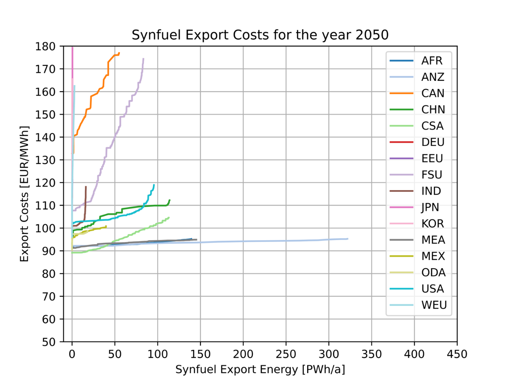

## Regional based Cost Potential Curves for Synfuels

The cost potential curves for synfuels are derived using the tools pyGRETA and urbs. A more detailed description can be found in [1]. The cost of synfuels based on a yearly acitivity can be found in Figure 1. 

 
Figure 1: Global Synfuel cost-potential curve for each TIAM region. Source: [1]

The synfuel supply is modeled using the same methodology as shown in [Regional based Cost Potential Curves for Hydrogen](https://etsap-tiam.readthedocs.io/en/latest/exogenous/cost-potential-curves-hydrogen.html). There are 8 different steps to model the cost increase for higher activity, as well as for hydrogen. The only occuring difference is, that synfuels don’t need to be liquefied for transport. While hydrogen was differentiated between H2SupplyEXP1-8 for liquid hydrogen and H2SupplyLoc1-8 for gaseous hydrogen, synfuels are described by SynSupply1-8 for both local and export demand. 

### References
[1]	P. Buchenberg et al., “Global Potentials and Costs of Synfuels via Fischer-Tropsch Process,” MDPI Energies, 2023.
