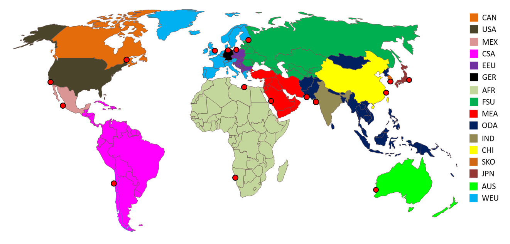
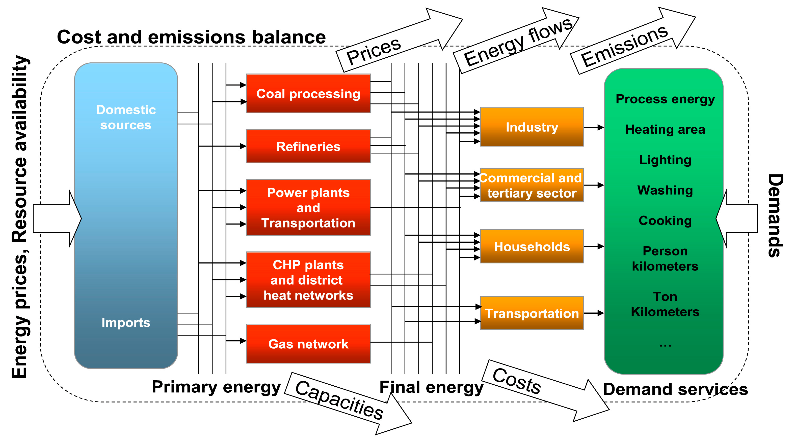

# Model Overview

Energy system models are used to measure the impact of climate policy and find path dependencies when decarboizing the energy system.
TIAM (TIMES Integrated Assessment Model), is a technology-rich bottom-up optimization model minimizing the total discounted system costs. On a spatial level, TIAM considers 16 regions, in which some regions represent countries (e.g., the US) and others are aggregated (e.g., Africa); see Figure 1. [Region description](../regional_coverage/region-description.md) provides further information about the TIAM regions. 

 

Figure 1. TIAM map.

Processes and commodities are the main elements of TIAM. Commodities are defined as all energy carriers (e.g., coal, oil, hydrogen, etc.) or materials (e.g., steel, cement, etc.) and can be produced out of technology processes, as well as emissions. Processes are all technologies that produce or provide commodities, e.g., cars in the transport sector or heating technologies in the household sector. All technologies have certain properties, such as their lifetime, investment costs, operation and maintenance costs and availability. The whole procedure is based on investment decisions. These properties ensure that there is a competition of all the technologies and a cost-optimal path can be found. 

As a starting point of the underlying methodology, commodities are provided by domestic mining or imports as primary energy for further processing. Certain parameters are exogenously set as energy prices or potentials for mining. The primary energy is provided to be converted to the final energy sectors to satisfy the end use demand.

The end use sectors in TIAM are split into five different categories: industry, transport, households, commercial and agriculture (see Figure 2).

The time horizon of TIAM starts in 2018 and ends in 2100. The demand is based on the statistics of the base year in 2018, and it is projected via drivers such as GDP or changes in population. Furthermore, TIAM distinguishes between twelve time slices. There are four for each season and three for day, night and the peak hour. 

 
Figure 2. Energy system model TIAM scheme. Source: [3].

## References
[1]	B. Mousavi and M. Blesl, “Analysis of the relative roles of supply-side and demand-side measures in tackling the global 1.5°C target.: Published in Giannakidis G., K. Karlsson, M. Labriet, B. Ó Gallachóir (eds.), Lim-iting Global Warming to Well Below 2° Energy System Modelling and Policy Development. Springer, Lecture Notes in Energy,” 2018.

[2]	B. Mousavi, “Analysis of the relative roles of supply-side and demand-side measures in tackling global climate change: Application of a hybrid energy system model,” 2019.

[3]	U. Remme, Overview of TIMES: Parameters, Primal Variables & Equations.
