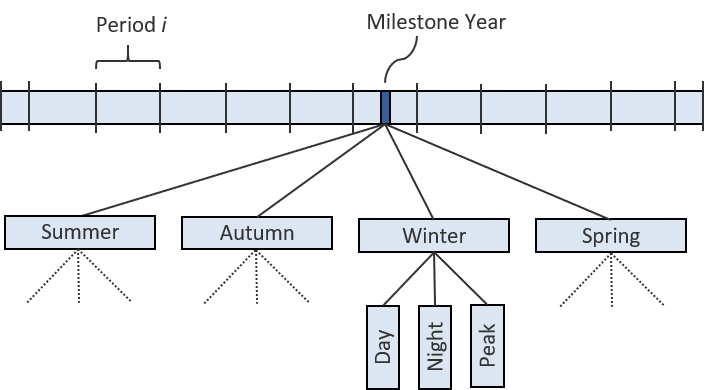

# Time Resolution

The TIAM model covers a time horizon from 2018 to 2100, which is divided into ten periods. The model splits each time period into twelve time slices consisting of four seasons, namely, summer, autum, winter and spring with equal length (i.e., three months). To consider changes in load based on sector demand profiles, each season is further divided into day, night and peak (cf. Figure 1).

 

Figure 1: Temporal resolution implemented in the TIAM model.

Depending on the purpose of the study, the model is flexible to increase the number of inter-annual time-slices. This allows a much more detailed representation of variations in energy demand and supply, including operating characteristics of specific technologies.

## References
Babak Mousavi, “Analysis of the relative roles of supply-side and demand-side measures in tackling global climate change: Application of a hybrid energy system model,” vol. 2018.
