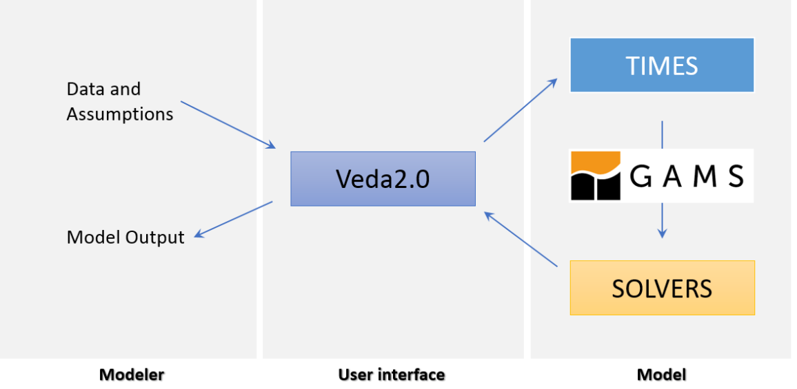

## Handling Shells

The energy systems model TIAM has been formulated using VEDA2.0 interface. VEDA2.0 is a valuable tool used to solve complex mathematical and economical optimization models. It has a user-friendly front-end interface to create, maintain, browse and modify large data bases required by the mathematical models. The Veda2.0 framework provides both frontend and backend [1]. 
All the data and the respective assumptions are initially fed into VEDA. This interface inturn provides the input to the TIMES-TIAM model. The model then feeds the input values, constraints and the objective function to GAMS framework. GAMS stands for Generic Algebraic Modeling System. It is an efficient modeling language used to provide optimal solutions for given mathematical models [2]. The solution of this model is then fed back to VEDA. After post-processing, VEDA then displays the model output: numerical and graphical results of the solved model to the user in an Excel sheet. The post-processing is done in a manner so that the end results can easily be interpreted by user via the interface. The complete functioning layout of the data inputs, VEDA interface, TIMES-TIAM model, GAMS and the model ouptut is shown in Figure 1.

 
Figure 1: Block diagram of VEDA2.0 user interface along with inputs and outputs [1].

### References

[1] 	„ETSAP, VEDA Description,“ 2023. [Online]. Available: https://www.iea-etsap.org/index.php/etsap-tools/data-handling-shells/veda.

[2] 	„GAMS- General Algebraic Modelling System,“ 2023. [Online]. Available: https://www.gams.com/.

