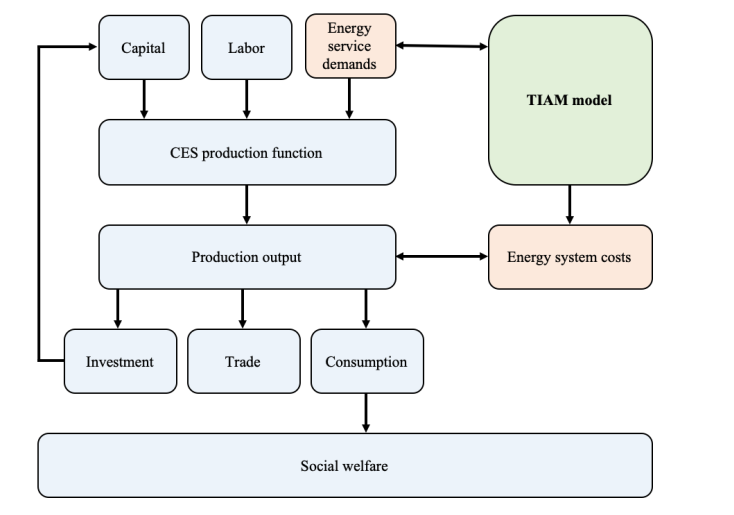

## Link To Other Models

### General Linkage

The TIAM model is a technology-rich bottom-up model that describes the competition of technologies (e.g. coal power plants, solar PV, wind onshore in the power sector) to satisfy the energy service demands on a microeconomic level, see Figure 1. In order to extend this view, different approaches to linkage can be applied, see Table 1. 

 

Figure 1: Bottom-up and top-down models in comparison [1].

Table 1: Main benefits and challenges of different linking approaches.
| **Link approach** | **Main benefit(s)**         | **Main challenge(s)**                       |
| ----------------- | --------------------------- | ------------------------------------------- |
| Soft-linking      | Flexibility                 | Inconsistency                               |
| Hard-linking      | Consistency                 | Superficiality                              |
| Full integration  | Flexibility and consistency | Dimensionality and computational complexity |

### TIAM Macro Model

The TIAM model can be extended by a macro model in order to get the macroeconomic view included (cf. figure 1). TIAM is a linear energy system model while the macro module is represented by a non-linear macroeconomic model called TIAM-Macro Stand-alone (TSAM). The key function of the TSAM model is the constant elasticity of substitution (CES) function (cf. figure 2). By using the CES function the economic behaviour in the sense of resource distribution can be described. All the physical commodity trades are endogenously modeled in TIAM, the monetary trades are done in TSAM (based on numéraire goods).

The TIAM model has connections to the energy system cost, as well as the energy service demands (cf. figure 2), while the TSAM model uses capital and labor for the CES function in order to create feedback loops that affect the TIAM model, based on the energy system costs (cf. figure 2).

 
Figure 2: TIAM Model linked to Macro extension [1].

### References
[1]	B. Mousavi and M. Blesl, “Analysis of the relative roles of supply-side and demand-side measures in tackling the global 1.5°C target.: Published in Giannakidis G., K. Karlsson, M. Labriet, B. Ó Gallachóir (eds.), Lim-iting Global Warming to Well Below 2° Energy System Modelling and Policy Development. Springer, Lecture Notes in Energy,” 2018.
