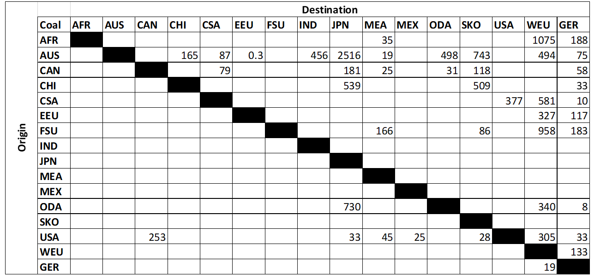

## Import and Export

In TIAM, import and export of commodities from/to different countries is included. These commodities include electricity, crude oil, coal, natural gas, naptha, gasoline, LNG, hydrogen, CO2 and ammonia. Infrastructure for export from one region to another region is modelled in TIAM for each commodity individually. Infrastructure includes power lines for electricity, pipelines and ship transport. For each commodity, TIMES attributes are applied between every two TIAM regions to calculate the limit and the total cost of import. For instance, investment cost for pipeline transport and activity cost for ship transport are evaluated and entered in the model.  

The energy carriers such as coal, oil, gas and uranium are concentrated in specific countries. Hence, only few TIAM regions are chosen for export of the conventional energy sources and other specific regions for import. Figure 1 below shows an example of coal trade with an activity bound, a TIMES attribute for trade limit, between TIAM regions.  

 
Figure 1. Activity bound of coal trade (in PJ) between world regions for year 2015.

Coal is transported by ship between the TIAM regions. Major exporters are Africa, Australia, China and the USA; major importers are Japan, South Korea, WEU and Germany [1].

Oil is transported either by tanker or pipeline. Pipeline infrastructure exists in the regions- FSU, WEU, EEU, Germany, Canada and the USA.For the other regions, tankers are used for import and export. Major oil exportering regions are MEA, FSU, Africa and CSA  [1].

Gas can either be transported via pipeline at high pressure or as liqueified natural gas (LNG) by tanker. Major exporters of Gas via pipeline are FSU and Africa followed by Canada. On the other hand, major LNG exporting regions are ODA, MEA, Africa and Australia  [1].

Electricity has the possiblity for import and export only between the European Union. The TIAM regions- WEU, EEU and Germany have the possiblity for electricity trade using power transmission lines.

Unlike other commodities, information regarding import and export of uranium is barely available for public. Hence, a world market is modelled in such a way that all regions can import uranium from the market based on the global market prices. The TIAM region “gbl” is modelled for this purpose where uranium can be imported from gbl to other regions. 

Commodities such as hydrogen, ammonia and synfuels can be produced in any TIAM region due to the availability of technologies to produce them. Hence, all the regions are given the possibility to import or export them from/ to other regions via ship transport. For ship transport, one specific harbour/ port is selected for each TIAM region except for Africa. Africa, due to its size, has two ports [2]. Further information related to the location of the ports and the trade of commodities is mentioned in the section “Global trade of commodities”.

References

[1] 	U. Remme, M. Blesl und U. Fahl, „Global resources and energy trade: An overview of coal, natural ga, oil and uranium,“ Stuttgart, 2007.

[2] 	F. Lippkau, D. Franzmann, T. Addanki, P. Buchenberg, H. Heinrichs, P. Kuhn, T. Hamacher und M. Blesl, „Global hydrogen and synfuel exchanges in an emission-free energy system,“ Energies , Bd. 16, 2023. 

