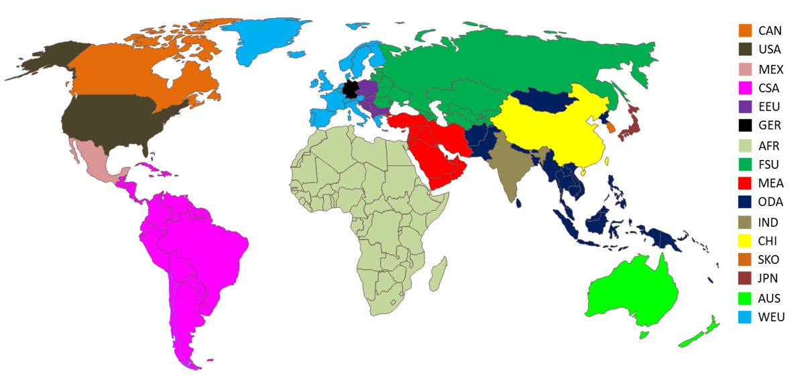

## Region description
The considered regions of TIAM can be seen in figure 1. All are listed seperatly in table 1. 

 
Figure 1. TIAM regions on global map.

Table 1: TIAM Regions with description.
| TIAM Region | Region Name               | Further Description                                                                                                                 |
|-------------|---------------------------|-------------------------------------------------------------------------------------------------------------------------------------|
| AFR         | Africa                    | Full African continent                                                                                                              |
| AUS         | Australia                 | Australia, New Zealand                                                                                                              |
| CAN         | Canada                    | -                                                                                                                                   |
| CHI         | China                     | -                                                                                                                                   |
| CSA         | Central and South America | Full South America and North America except Canada, USA and Mexico                                                                  |
| EEU         | Eastern European Union    | Albania, Bosnia–Herzegovina, Bulgaria, Croatia, Czech Republic, Hungary, Macedonia, Poland, Romania, Slovakia, Slovenia, Yugoslavia |
| FSU         | Former Soviet Union       | Russia and old Soviet states                                                                                                        |
| GER         | Germany                   | -                                                                                                                                   |
| IND         | India                     | -                                                                                                                                   |
| JPN         | Japan                     | -                                                                                                                                   |
| MEX         | Mexico                    | -                                                                                                                                   |
| MEA         | Middle East Asia          | Near East except Africa                                                                                                             |
| ODA         | Other Developing Asia     | Asia except China, India, Japan and South Korea                                                                                     |
| SKO         | South Korea               | -                                                                                                                                   |
| USA         | United States of America  | -                                                                                                                                   |
| WEU         | Western European Union    | Portugal, Spain, France, Great Britain, Sweden, Norway, Finland, Italy, Greece, Switzerland, Austria                                |

