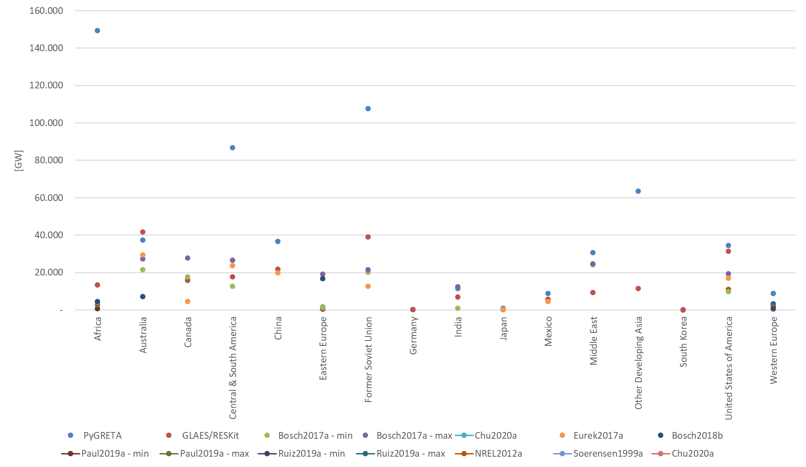
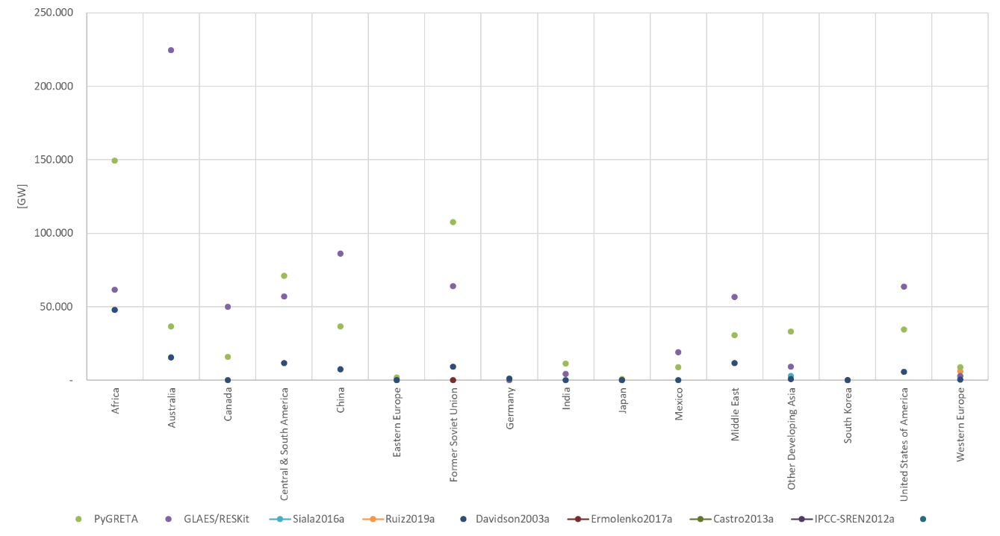
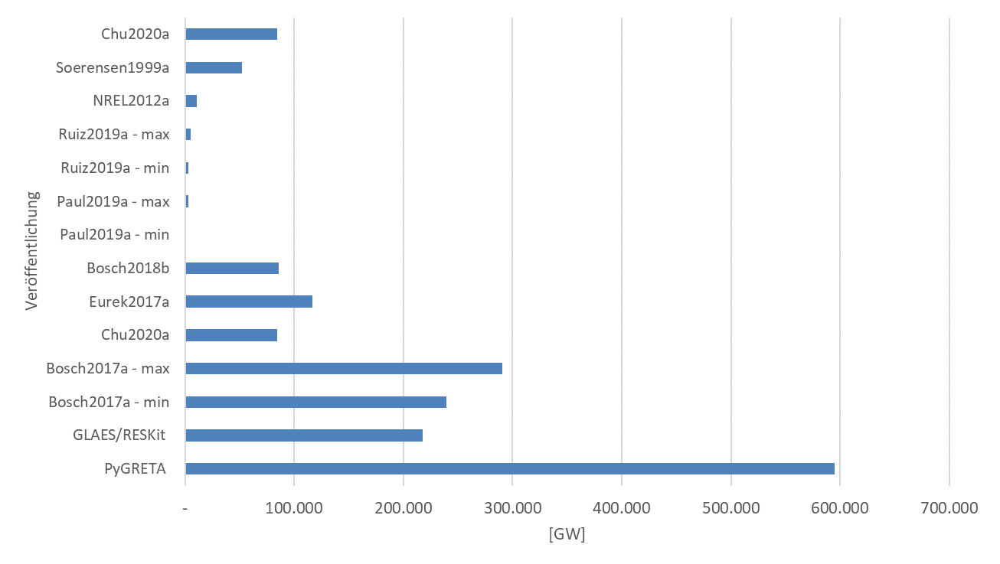
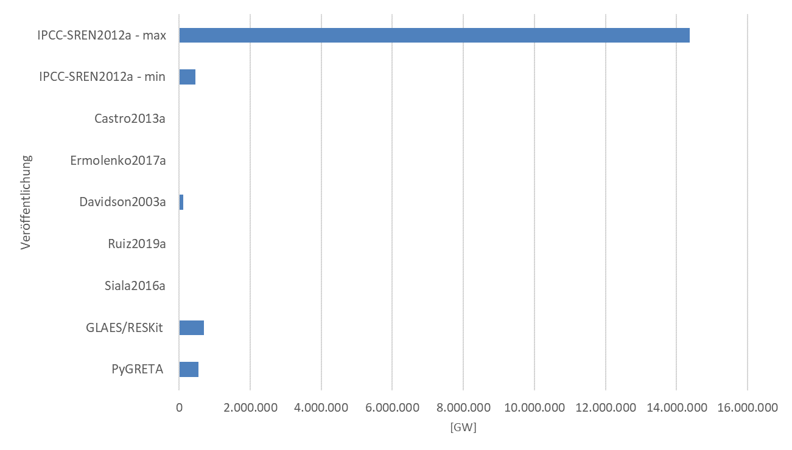

# Potentials for Renewable Energies

## Regional based Renewable Potentials for TIAM

The regional based potentials of renewable energie as solar pv and onshore wind can be found in Table 1.

Table 1: Global Renewable Potentials. Source [2].
| TIAM-Region  | PV Capacity [GW] | PV annual Production [TWh/a] | Wind Capacity [GW] | Wind annual Production [TWh/a] | Biomass annual Production [TWh/a] |
|--------------|------------------|------------------------------|--------------------|--------------------------------|-----------------------------------|
| AFR          | 155809           | 328679                       | 13670              | 19734                          | 11667                             |
| AUS          | 350321           | 734415                       | 36613              | 67927                          | 1375                              |
| CAN          | 109453           | 96254                        | 39656              | 46159                          | 772                               |
| CSA          | 137176           | 253929                       | 22320              | 30057                          | 20833                             |
| CHI          | 137742           | 240151                       | 40990              | 45890                          | 7728                              |
| EEU          | 397              | 531                          | 690                | 1053                           | 1728                              |
| FSU          | 118822           | 124550                       | 85917              | 85392                          | 1296                              |
| GER          | 342              | 395                          | 285                | 559                            | 599                               |
| IND          | 17411            | 31612                        | 11124              | 8691                           | 12492                             |
| JPN          | 268              | 405                          | 795                | 834                            | 981                               |
| MEX          | 47236            | 93199                        | 8840               | 6096                           | 631                               |
| MEA          | 166948           | 346708                       | 12528              | 15799                          | 278                               |
| ODA          | 21365            | 42250                        | 3593               | 3033                           | 10575                             |
| SKO          | 51               | 82                           | 184                | 193                            | 406                               |
| USA          | 111869           | 188404                       | 35492              | 49295                          | 6248                              |
| WEU          | 4756             | 3964                         | 1795               | 3122                           | 5719                              |

Based on a literature review, studies on renewable energy potentials were examined. Included are studies with the models GLAES/RESKit (cf. Franzmann et al. [1]) and PyGRETA (cf. Buchenberg et al. [2]), which have investigated the global renewable potentials within the project "ETSAP Deutschland" (cf. Figure 1 & Figure 2).

The comparison of the wind onshore studies with the results from the GLAES/RESkit and PyGRETA models is shown in Figure 1 can be seen. For wind onshore, some studies could be identified that investigate technical potentials based on GIS models with the addition of land use criteria. Studies that investigate the global technical potential based on all TIAM regions could not be found, yet there are some studies that evaluate several TIAM regions using the chosen approach. Among them are the studies by Bosch et al., Eurek et al., and Ruiz et al. [3–6]. However, the studies here show significant differences in terms of results. For example, in these studies for Africa, the values, GLAES/RESKit and PyGRETA included, range from 601.5 GW to 149418.6 GW. This is partly because the TIAM Africa region aggregates the individual African countries. Many of the studies mentioned, however, only represent sub-areas of the TIAM regions, which makes a comparison difficult. If individual countries are compared, the picture is usually very similar; for example, the values for Germany in PyGRETA, GLAES/RESKit and Ruiz et al. [5] are close together at 283.8 GW, 294.77 GW and 308 GW (max. scenario). 

In general, it can be said for the literature comparison based on onshore wind that the values are very scattered. The literature comparison cannot identify exactly to what extent the regional consideration has an influence on the results, but it has also been shown that on a country comparison the results of the literature almost match those of PyGRETA and GLAES/RESKit (cf. Mexico in Figure 1).

As with onshore wind energy, the literature research for PV shows that little attention is currently paid to the global potentials, see Figure 2. Only the studies by Davison et al. [7] examine several regions, while the other studies partly cover individual regions or countries. Furthermore, studies can be found which only quantify the global potential in total, but do not deal with individual regions, see IPCC study [8], which on the one hand allows the comparison of the studies on a global level, but is insufficient for an integration into an energy system model for the respective TIAM regions. 

Compared to PyGRETA and GLAES/RESKit, the study by Davison et al. [7] shows a slight underestimation of the technical potentials for all regions investigated. In general, the literature comparison with PyGRETA and RESKit shows that differences become larger the more countries are combined into one region. This leads to the conclusion that in the publications partial areas of the countries are examined and thus technical potentials were underestimated. Also, some of the studies date back years, so it can be assumed that with the progress of technology, a more precise recording can be made by means of GIS and the results are more reliable in this respect.  

 
Figure 1: Study comparision on onshore wind. Sources: [1, 2, 5, 6, 9–12].

 
Figure 2: Study comparison on solar pv. Sources: [1, 2, 5, 7, 8, 13–15].

The global comparison of the technical potentials for onshore wind is shown in Figure 3. The figure clearly shows that the literature leads to different results. The differences can be explained by the fact that only the potential analysis with the PyGRTEA model includes all countries of the world. Accordingly, this potential analysis shows the highest global values.  

Figure 4 shows a comparison of the global potentials for solar PV. It is clear from this that the IPCC report [8] in particular shows very high technical potentials for PV globally. The remaining studies differ again in terms of the re-regional coverage. A clear trend towards global PV potentials cannot be identified on the basis of the studies available to date.

 
Figure 3: Study comparison on global onshore wind potential.

  
Figure 4: Study comparison on global solar PV potential.

In the case of biomass potentials, many studies have projected global biomass potential up to 2050, but there is significant variation in their estimates. These predictions range widely, from 33 EJ to 1200 EJ, depending on the methodologies and scenarios used by the researchers [16–19]. Each research paper presents a wide range of biomass potential estimates based on different scenarios. A recent study from 2023, for instance, projected biomass potentials ranging from 64 EJ to 1192 EJ by 2050 across three scenarios [19]. Only one study, published in 2015, provided a global biomass estimate for 2100, ranging from 105 EJ to 325 EJ [18]. Additionally, the IEA’s Net-Zero report and IRENA’s World Energy Transitions Outlook reported the utilization of 100 EJ and 125 EJ of primary biomass for end-use demands, respectively [20, 21]. 
For a more realistic projection of biomass potential, considering trade-offs between optimal land use for food and feed production, sustainability, and bioenergy supply, 300 EJ (or 83340 TWh) was adopted as the global biomass potential for the TIAM model. Additionally, some of the research works provided regional biomass potentials based on their methodologies [16–18]. Each work does not meet exactly with the regional potentials but all of them agree that CSA region has the highest share of biomass potential (around 25%) followed by Africa (14%). Germany has a technical biomass potential of 2200 PJ as reported by [22]. The biomass potential shares for the rest of the TIAM regions have been considered from the research works mentioned above and based on own calculations and reported in Table 1. 

## References
[1]	D. Franzmann et al., “Green Hydrogen Cost-Potentials for Global Trade”, Mar. 2023. [Online]. Available: https://arxiv.org/pdf/2303.00314

[2]	P. Buchenberg et al., “Global Potentials and Costs of Synfuels via Fischer-Tropsch Process”, MDPI Energies, 2023.

[3]	J. Bosch, I. Staffell, and A. D. Hawkes, “Temporally-explicit and spatially-resolved global onshore wind energy potentials”, Energy, vol. 131, pp. 207–217, 2017, doi: 10.1016/j.energy.2017.05.052.

[4]	J. Bosch, “Bosch-J-2019-PhD-Thesis”

[5]	P. Ruiz et al., “ENSPRESO - an open, EU-28 wide, transparent and coherent database of wind, solar and biomass energy potentials”, Energy Strategy Reviews, vol. 26, p. 100379, 2019, doi: 10.1016/j.esr.2019.100379.

[6]	K. Eurek, P. Sullivan, M. Gleason, D. Hettinger, D. Heimiller, and A. Lopez, “An improved global wind resource estimate for integrated assessment models”, Energy Economics, vol. 64, no. 1, pp. 552–567, 2017, doi: 10.1016/j.eneco.2016.11.015.

[7]	J. Davison, “THE POTENTIAL OF SOLAR ELECTRICITY TO REDUCE CO2 EMISSIONS”, 2003.

[8]	IPCC, Renewable energy sources and climate change mitigation: Special report of the Intergovernmental Panel on Climate Change. New York: Cambridge University Press, 2012.

[9]	E. Paul, “Continental-scale assessment of the African offshore wind energy potential”, 2019.

[10]	NREL, “U.S. Renewable Energy Technical Potentials: A GIS-Based Analysis”

[11]	C.-T. Chu and A. D. Hawkes, “A geographic information system-based global variable renewable potential assessment using spatially resolved simulation,” Energy, vol. 193, p. 116630, 2020, doi: 10.1016/j.energy.2019.116630

[12]	J. Bosch, I. Staffell, and A. D. Hawkes, “Temporally explicit and spatially resolved global offshore wind energy potentials,” Energy, vol. 163, no. 5, pp. 766–781, 2018, doi: 10.1016/j.energy.2018.08.153.

[13]	C. de Castro, M. Mediavilla, L. J. Miguel, and F. Frechoso, “Global solar electric potential: A review of their technical and sustainable limits,” Renewable and Sustainable Energy Reviews, vol. 28, no. 12, pp. 824–835, 2013, doi: 10.1016/j.rser.2013.08.040.

[14]	B. V. Ermolenko, G. V. Ermolenko, Y. A. Fetisova, and L. N. Proskuryakova, “Wind and solar PV technical potentials: Measurement methodology and assessments for Russia,” Energy, vol. 137, no. 15, pp. 1001–1012, 2017, doi: 10.1016/j.energy.2017.02.050.

[15]	K. Siala and J. Stich, “Estimation of the PV potential in ASEAN with a high spatial and temporal resolution,” Renewable Energy, vol. 88, no. 5, pp. 445–456, 2016, doi: 10.1016/j.renene.2015.11.061.

[16]	W. Wu et al., "Global advanced bioenergy potential under environmental protection policies and societal transformation measures," GCB Bioenergy, vol. 11, no. 9, pp. 1041–1055, 2019, doi: 10.1111/gcbb.12614.

[17]	E. SMEETS, A. FAAIJ, I. LEWANDOWSKI, and W. TURKENBURG, "A bottom-up assessment and review of global bio-energy potentials to 2050," Progress in Energy and Combustion Science, vol. 33, no. 1, pp. 56–106, 2007, doi: 10.1016/j.pecs.2006.08.001.

[18]	F. Creutzig et al., "Bioenergy and climate change mitigation: an assessment," GCB Bioenergy, vol. 7, no. 5, pp. 916–944, 2015, doi: 10.1111/gcbb.12205.

[19]	M. R. Errera, T. C. Dias, D. Maya, and E. Lora, "Global bioenergy potentials projections for 2050," Biomass and Bioenergy, vol. 170, p. 106721, 2023, doi: 10.1016/j.biombioe.2023.106721.

[20]	IEA and International Energy Agency, "Net Zero Roadmap: A Global Pathway to Keep the 1.5 °C Goal in Reach - 2023 Update", 2023.

[21]	International Renewable Energy Agency, "World Energy Transitions Outlook 2023: 1.5°C Pathway", 2023

[22]	A. Brosowski et al., "A review of biomass potential and current utilisation – Status quo for 93 biogenic wastes and residues in Germany," Biomass and Bioenergy, vol. 95, pp. 257–272, 2016, doi: 10.1016/j.biombioe.2016.10.017
