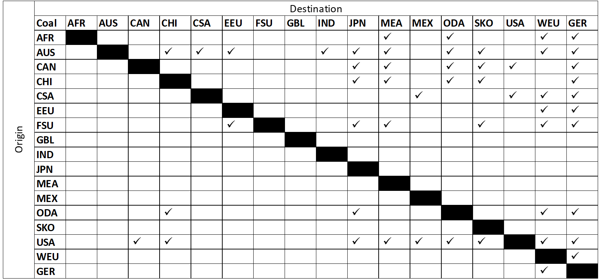
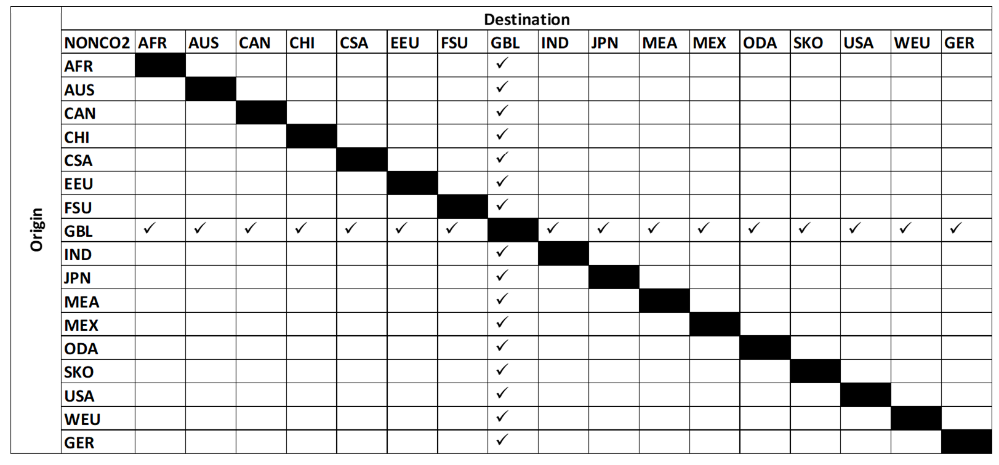

# Global Trade of Commodities

An important and key feature of TIAM is trading of commodities between different regions. As mentioned in the section “Import and Export”, specific commodities can be traded from one region to another mainly due to availability factor of the commodity in the regions and cost savings from domestic production. Following commodities are currently given an option for trading: Coal, Natural gas, LNG, crude oil, emissions (CO2 and non-CO2), uranium, hydrogen, ammonia and synfuels. 
Trading possibility is modelled in TIAM using a TradeLinks table. The corresponding infrastructure costs and limits involved are modelled using other TIMES attributes. By giving this possibility, the TIAM region can chose whether to trade a commodity and from/to which region(s) to do so based on the costs, trade limits and the demand necessity.
The conventional commodities- coal, natural gas, LNG and crude oil are modelled endogenously based on the statistics. In other words, as mentioned in the Import and Export section, trading is possible only among few regions due to high resource abundance. An example of coal trading is shown in Figure 1 below. 

Figure 1: Coal trading between different regions in TIAM model.

 

Few commodities which include uranium, scrap iron and crude steel have a different trade scenario. A global region (GBL) is defined which acts as a world market. In this case, commodities can be traded with the world market based on the necessity and reduce costs.
CO2 and other non-CO2 emissions can be also be traded in the model. These commodities, similar to uranium, can be traded via the world market (GBL region) so that the costs of global or regional emission targets can be reduced. Net trade of the market is always zero for any year. Figure 2 shows an example of the trading of a commodity using the world market. 

Figure 2: Trading of Non-CO2 emissions from the world market (GBL). 

Hydrogen, ammonia and other synfuels have recently evolved as energy carriers and can be produced in any region in the world. Hence, all TIAM regions have the possibility for bidirectional trade of these commodities, i.e. any region can import or export to any other region without restrictions. Currently, these commodities can be traded only via ship. Hence, harbours are selected for the regions. Table 1 depicts all the harbours selected for trading of these energy carriers between the regions. Based on the distance between the harbours, total costs are calculated for trade and entered into the appropriate TIMES attributes. TIAM regions can then select how much quantity needs to be traded to achieve the least cost.  

Table 1: Harbour selection for the TIAM model.

| Region | Port Name                | Latitude     | Longitude    |
|--------|--------------------------|--------------|--------------|
| AFR    | Port of Walvis Bay       | −22.94438616 | 14.48237595  |
| SKO    | Port of Busan            | 35.10370188  | 129.0414886  |
| CSA    | Port of Buenos Aires     | −34.56909495 | −58.38273273 |
| AUS    | Fremantle Ports          | −32.0529628  | 115.7408536  |
| CAN    | Port of Quebec           | 46.82265707  | −71.20249041 |
| CHI    | Port of Shanghai         | 30.63068515  | 122.0847303  |
| GER    | Port of Hamburg          | 53.5410807   | 9.986766343  |
| WEU    | Port of Birmingham       | 53.63207459  | −1.85406508  |
| IND    | Mundra Port              | 22.74104731  | 69.7157146   |
| JPN    | Port of Keihin           | 35.42669641  | 139.6843441  |
| AFR    | Port of Benghazi         | 32.110470309 | 20.0423606   |
| MEX    | Puerto De Manzanillo     | 19.7070599   | −71.7447426  |
| ODA    | Port of Karachi          | 24.83708206  | 66.98086793  |
| EEU    | Port of Gdynia           | 54.5360318   | 18.53554754  |
| FSU    | Port of Saint Petersburg | 59.88860049  | 30.18117919  |
| MEA    | Port of Jeddah           | 21.49503622  | 39.1551345   |
| USA    | Port of Los Angeles      | 33.72839414  | -118.2402335 |
