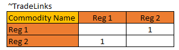
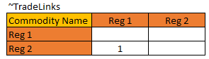

# Global Trade of Commodities

## Implementation
In TIAM, there is a possibility of trading commodities among the different regions of the model. This can be done either through bidirectional or unidirectional trading. To enable trade, a trade matrix is used where the traded commodity must be specified together with the participating trading regions, see figure 1 and figure 2.

Figure 1: Bidirectional trade of commodities between region 1 (REG1) and region 2 (REG2).

 

Figure 2: Unidirectional trade of commodities between region 1 (REG1) and region 2 (REG2).

The trade matrix only establishes the links between trading regions, but does not specify the cost that occur when trading. The asssociated costs can specified by applying TIMES attributes to trade process. This could either be done gy specifying investment cost (e.g. for pipeline transport) or activity cost (e.g. for shipping transport). Furthermore, the activity of trade could be limited via a user constraint. 

## Trades in TIAM

Trades in TIAM are implemented for various commodities, including crude oil, coal, natural gas naphtha, gasoline, LNG and uranium. All of the trades are calibrated based on the IEA energy statistics of 2015.
