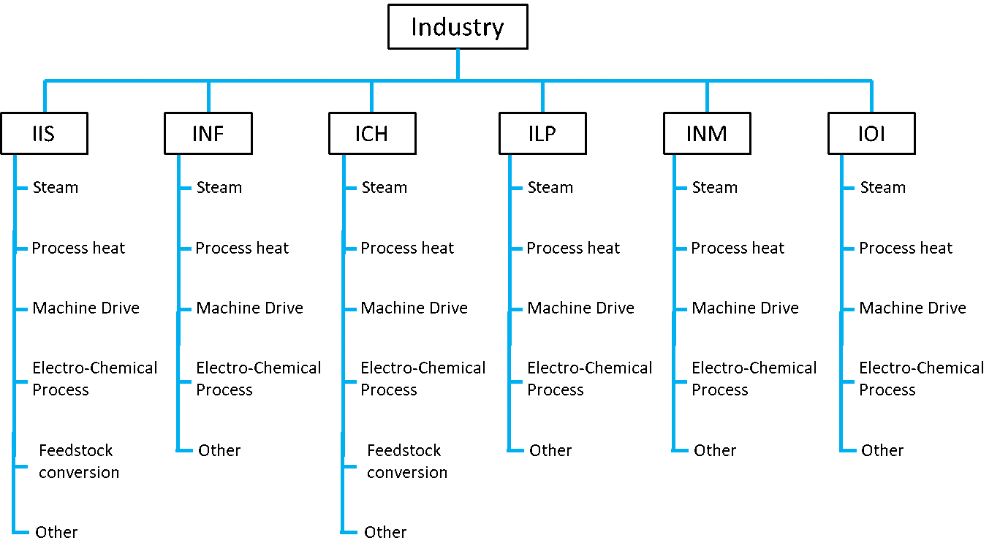
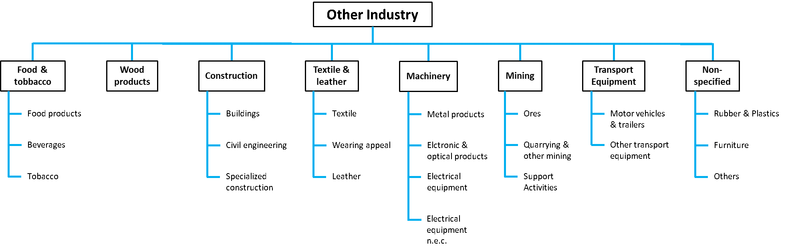

## Industry

To classify the demand for energy services in the industrial sector, it is divided into "chemicals" (ICH), "iron and steel" (IIS), "pulp and paper" (ILP), "non-ferrous metals" (INF), "non-metals" (INM) and "other industries" (IOI) (cf. figure 1) and either the production volume in Mt or the total energy demand in PJ is given in each case (cf. table 1). In addition, a distinction is made between demand for "other unspecified energy consumption" (ONO), "industrial and other non-energy uses" (NEO) and "other industries" (IOI). The “Other Industries” is specifically shown in figure 2.
The industrial sector also includes in-house and industrial production of electricity, heat and combined heat and power (CHP). In ETSAP-TIAM, non-energy-related emissions from industry are recorded and modelled in addition to energy-related emissions, but not process emissions.

 
Figure 1: Industry subsectors in TIAM.

 
Figure 2: Other Industries (IOI) in TIAM.

Table 1: Industry Subsector Units.
| **TIAM Code** | **Energy service demand**            | **Unit** | **Driver** |
| ------------- | ------------------------------------ | -------- | ---------- |
| **ICH**       | Chemicals                            | PJ       | GDP        |
| **IIS**       | Iron and Steel                       | Mt       | GDP        |
| **ILP**       | Pulp and Paper                       | Mt       | GDP        |
| **INF**       | Non-ferrous metals                   | Mt       | GDP        |
| **INM**       | Non Metals                           | PJ       | GDP        |
| **IOI**       | Other Industries                     | PJ       | GDP        |
| **NEO**       | Industrial and Other Non Energy Uses | PJ       | GDP        |
| **ONO**       | Other non-specified consumption      | PJ       | GDP        |

Various technologies and fuels suitable for the provision of steam, electrochemical processes, machine drives and process heat are modelled in order to map the energy demand of each industry for the base year. Due to the elastic demand for energy services, parameters are defined to describe the elasticity and used in the model. The projection of demand for energy services up to the year 2100 is carried out using suitable [drivers and elasticities](../regional_coverage/demand-projection.md).

Hundreds of technologies are used in the industrial sector to harness various energy sources to meet the demand for energy services. The available technologies compete with each other and are characterised on the basis of parameters such as achievable efficiency, plant service life, annual utilisation factor and seasonal share coefficients. It is assumed that technical systems based on a technology used in the base year 2018 can be used until the end of their service life. New investments in existing technologies may not be made in any industrial sector, meaning that the new technologies will gradually replace the existing ones based on parameters such as higher efficiency and lower investment costs. Hurdle rates for new technologies range from 10% for developed countries (e.g. Australia and Canada) to 20% for least developed countries (e.g. India and continent of Africa).

For the base year 2018, the IEA energy balance data, which is stored in the model in the template for the industry base year, was used to calibrate the final energy consumption. In the IEA database, only the total energy consumption for the most important industrial sectors is specified for each energy source, which is why a detailed breakdown of energy services by energy source within individual industrial sectors requires the use of fractional figures. The IEA database also contains information on ONOs and NEOs. Each energy service is broken down in the IEA data according to the various technologies and energy sources, so that a local and global energy demand for the base year can be read off. The percentage distribution of different technologies (e.g. electrochemical processes, process heat) is assumed to be identical for each region. In the energy system model, the total final energy consumption of the industrial sectors corresponds to the total final consumption of the upstream sector by energy source.
